# PM2.5

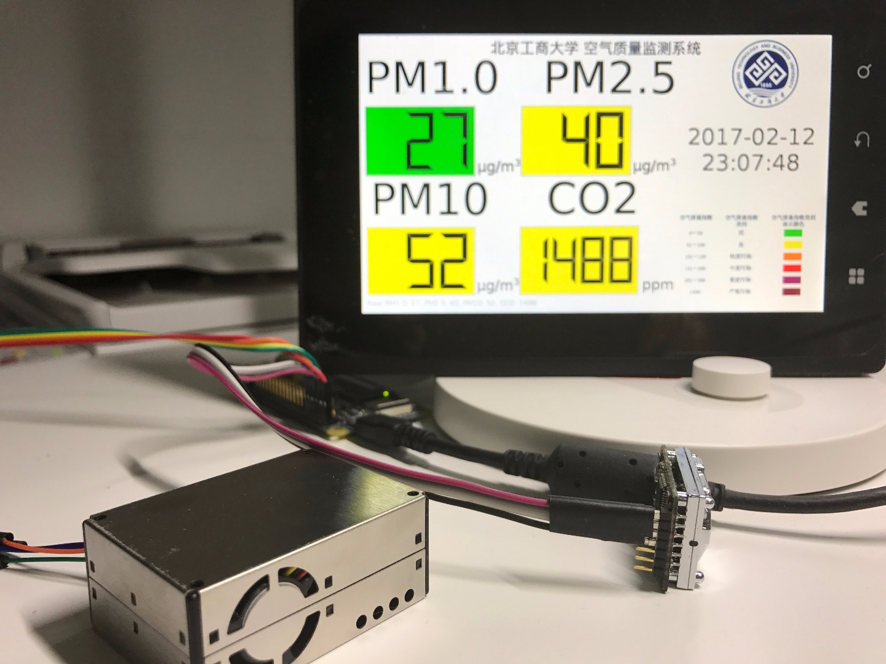

# 为什么做这个

其实很简单，我本科学自动化的，毕业设计选题的时候正好看到了这个题目，觉得很简单，对于生活在帝都的我也很实用，于是就想做个这个**室内空气质量检测仪**。

# 思路

## 第一版思路

最初的想法是用 STM32 通过串口采集传感器的值，然后通过 SPI 驱动 OLED 显示屏显示当前的空气状况。如图所示：

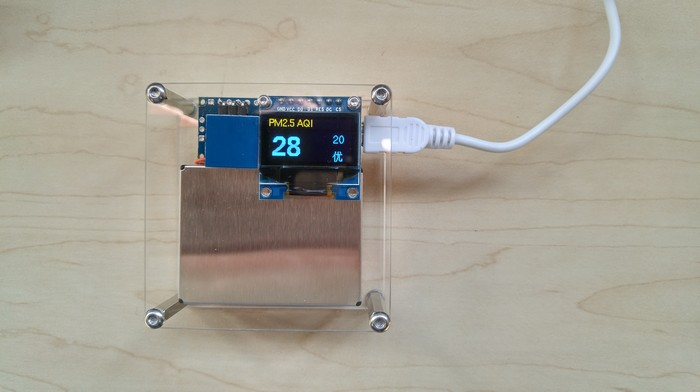

（图片来自某宝）

等做得差不多的时候发现，如果想记录历史值，十分麻烦，需要 WiFi 模块才能通讯。不然的话就需要采用 SD 卡的方案，但是查看历史记录又不方便，需要把 SD 卡抽出来用电脑读取，于是就换成带 WiFi 的 NanoPi2 了。

## 第二版思路

第二版直接采用可以运行 Debian 操作系统（Linux）的 NanoPi2，自带 WiFi，并且 IO 口也引出来了，做一个小型物联网设备十分方便，正好他们厂家送了我一块7寸液晶彩屏，可以直接拿来显示当前的空气状况。

# 硬件

## 清单

我选择了攀藤科技的空气质量传感器，基本是我能买到的最好的厂商了。

| 名称       | 型号        | 价格（元） | 通讯   | 图片                                       |
| -------- | --------- | ----- | ---- | ---------------------------------------- |
| NanoPi2  | NanoPi2   | 199   | ssh  | [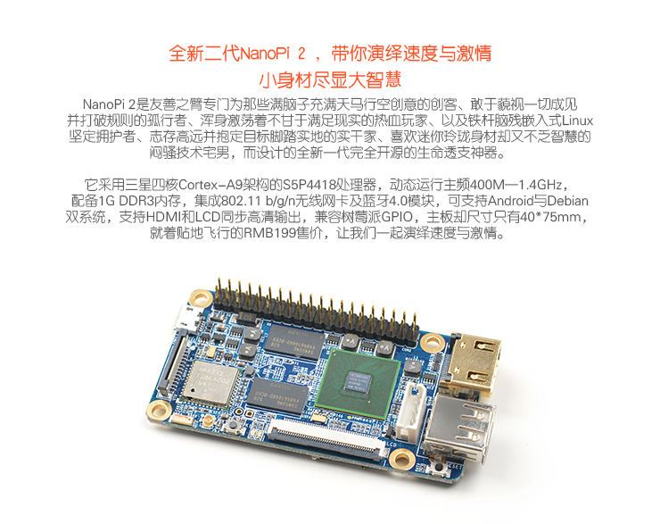](https://item.taobao.com/item.htm?id=524842034015) |
| PM2.5传感器 | PMS5003   | 110   | 串口   | [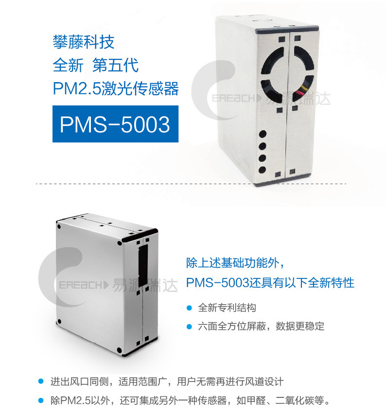](https://item.taobao.com/item.htm?id=524354539294) |
| CO2传感器  | DS-CO2-20 | 198   | 串口   | [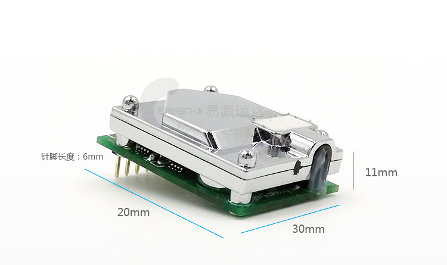](https://item.taobao.com/item.htm?id=540405255399) |
| 7寸屏      | X710      | 160   | 排线   | [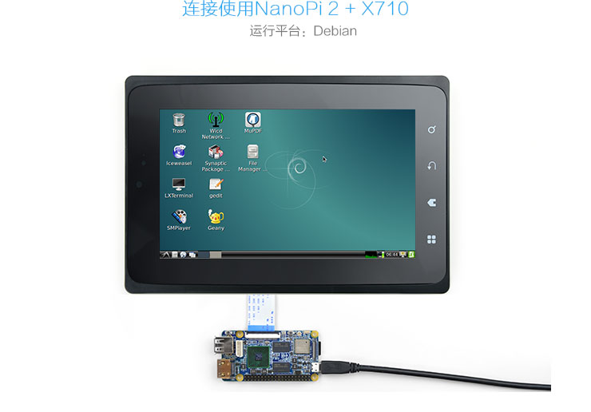](https://item.taobao.com/item.htm?id=526058309474) |

## 固定

由于现在的传感器和板子还只是用杜邦线简单连接，并不方便挂在墙上。因此有一个计划是画一个 PCB，将 NanoPi2，传感器都固定在上面。然后 PCB 也画好通孔，与各个模块还有屏幕之间，用铜柱固定，这样稳定性会更好。

不过，它很争气地运行了一个月都没出错，所以我一直懒得做。

# 软件

## 设备驱动

传感器买到了，但是厂家只提供[技术文档](https://github.com/ypwhs/PM2.5/tree/master/documents/Sensors)，并没有 NanoPi2 的驱动，所以需要自己写驱动程序读取传感器的数据。

首先按照 NanoPi2 的[接口定义](http://wiki.friendlyarm.com/wiki/index.php/NanoPi_2/zh#.E6.8E.A5.E5.8F.A3.E5.B8.83.E5.B1.80)连接传感器，CO2传感器 接串口3，PM2.5传感器接串口4，记得 TX 对 RX 以及接通电源。

然后根据文档中的描述，PM2.5传感器是主动发送数据，CO2传感器需要询问，所以我需要三个线程：

* 发送 CO2传感器数据请求 [[code]](https://github.com/ypwhs/PM2.5/blob/master/sensors_server/sensors.c#L25)
* 接收 CO2传感器数据并解析数据 [[code]](https://github.com/ypwhs/PM2.5/blob/master/sensors_server/sensors.c#L43)
* 接收 PM2.5传感器数据并解析数据 [[code]](https://github.com/ypwhs/PM2.5/blob/master/sensors_server/sensors.c#L62)

主线程只需要将它们解析出来的数据通过 UDP 传输到 UI 界面和远程服务器。通过 UDP 传输是因为刚好 Qt 和 python 都很容易写 UDP 服务器。

### 数据解析

这里解析数据用到了一种类似于状态图的东西。

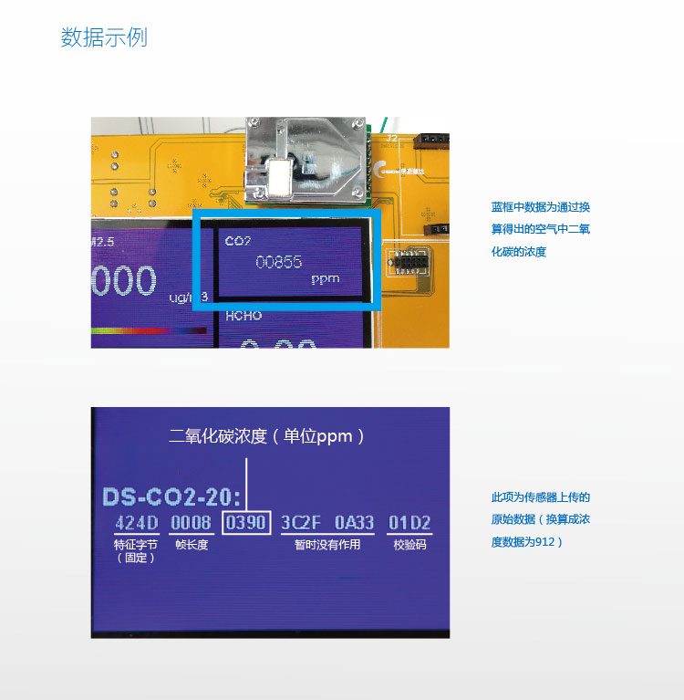

我通过做实验发现，它们的数据格式前四个字节都是 42 4D 00 08，然后紧接着的两个字节就是我们需要的数据，并且数据长度一定是12字节，因此我写了这样的程序：

```c
int co2 = 0, lastco2 = 0;
unsigned char co2s[12] = {0}, co2state = 0, update = 0;
void *readco2(void * pvoid){
    //42 4D 00 08 0A 4D 3C 7F 0A EA 02 9D
    while(1){
        co2s[co2state++] = read_one(UART_CO2);
        if( (co2state == 1) && (co2s[0] != 0x42) ) co2state = 0;
        else if( (co2state == 2) && (co2s[1] != 0x4d) ) co2state = 0;
        else if(co2state >= 12){
            co2 = (co2s[4]<<8) + co2s[5];
            co2state = 0;
            if(co2 != lastco2){
                lastco2 = co2;
                update = 1;
            }
        }
    }
}

```

	0. 接收数据
	1. 如果收到的数据不是 0x42 就跳回步骤0，否则跳到步骤2
	2. 如果收到的数据不是 0x4D 就跳回步骤0，否则跳到步骤3
	3~11. 持续接收数据
	12. 取出第五个数据和第六个数据，拼成16位整数，并跳回步骤0

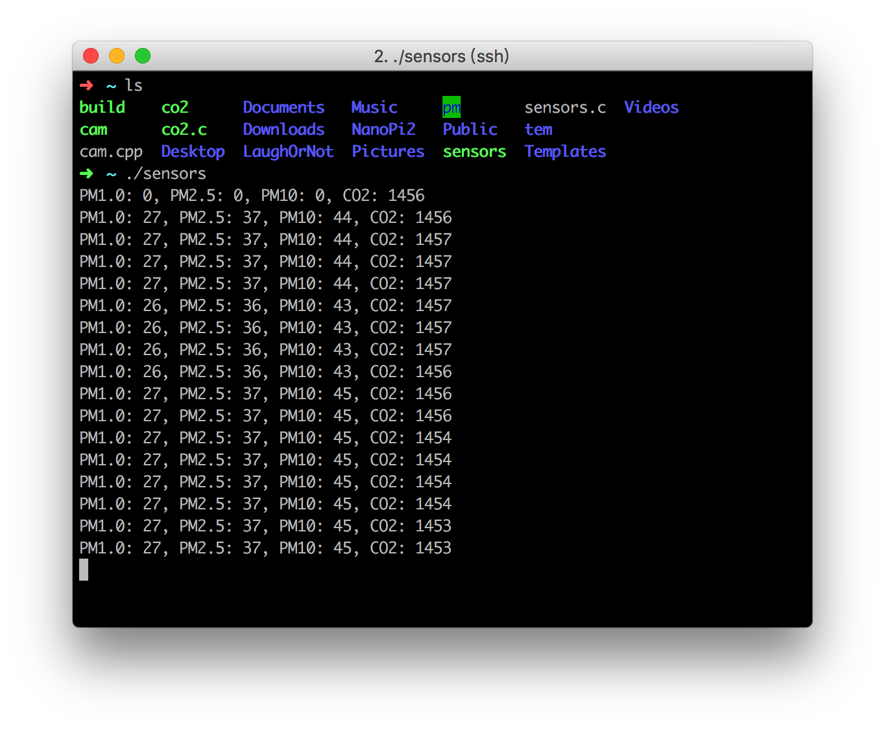

最后效果如图。

## UI界面

UI 界面直接用 Qt 搭出来的，Label 可以直接拖出来，窗口设置 1024\*600 全屏，鼠标直接隐藏，[使用线程](https://github.com/ypwhs/PM2.5/blob/master/pm/mainwindow.cpp#L46-L52)刷新时间，并用 [UDP事件](https://github.com/ypwhs/PM2.5/blob/master/pm/mainwindow.cpp#L112-L122) [更新](https://github.com/ypwhs/PM2.5/blob/master/pm/mainwindow.cpp#L54-L110) 传感器数据。背景颜色按照[国家标准](http://kjs.mep.gov.cn/hjbhbz/bzwb/dqhjbh/jcgfffbz/201203/W020120410332725219541.pdf)设置。至于学校的 Logo 是应导师要求加上去的。 [[code]](https://github.com/ypwhs/PM2.5/blob/master/pm/mainwindow.cpp)

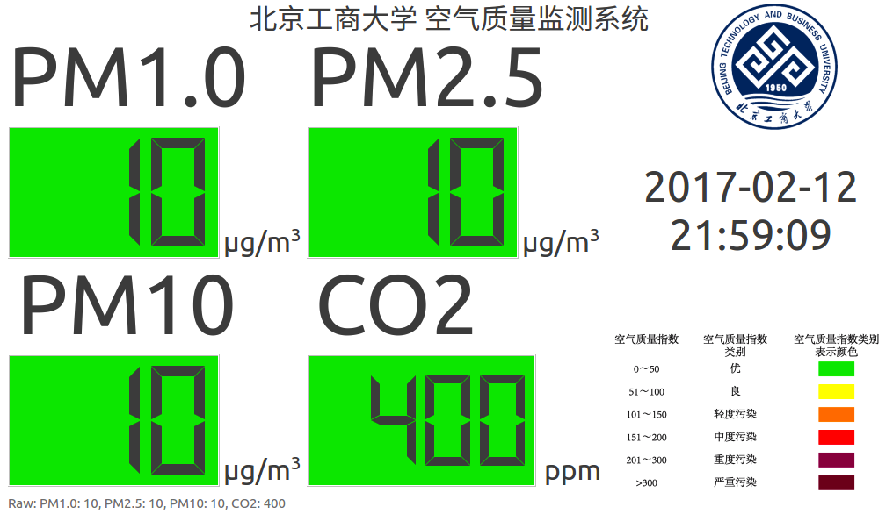

## 传感器记录程序

这部分主要工作是接收来自传感器的数据，然后存入数据库（SQLite）中。

代码只有27行，没有防注入和防恶意写入，所以请不要欺负我啊。 [[code]](https://github.com/ypwhs/PM2.5/blob/master/log_server/server.py)

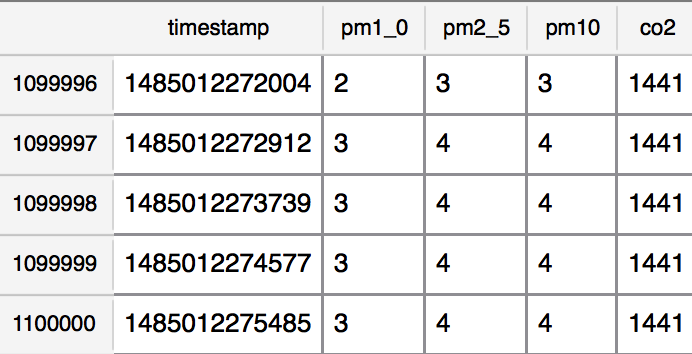

上图是使用 [DB Browser for SQLite](http://sqlitebrowser.org/) 查看数据库的效果。

## 前后端

这部分主要功能是显示历史室内空气质量曲线，提供了1小时，8小时，24小时这几个选项，也可以手动改成更长的时间。

### 后端

具体实现是用 Flask 写的，代码在这里： [[code]](https://github.com/ypwhs/PM2.5/tree/master/flask)。

为了使浏览器查看24小时数据甚至更长时间的数据的时候不卡，我限制了数据返回的个数，当数据量非常大的时候，会限制在10000条以内。[[code]](https://github.com/ypwhs/PM2.5/blob/master/flask/Flask.py#L57-L58)

```python
@app.route('/<float:hour>hour')
def index_hour(hour):
    before = int(time.time()*1000) - hour*3600*1000
    data = query_db('select * from pm where timestamp>%d' % before)
    while len(data) > 10000:
        data = data[::2]
    times = [x['timestamp'] for x in data]
    pm1_0 = [x['pm1_0'] for x in data]
    pm2_5 = [x['pm2_5'] for x in data]
    pm10 = [x['pm10'] for x in data]
    co2 = [x['co2'] for x in data]
    return render_template('chart.html', date=times, pm1_0=pm1_0, pm2_5=pm2_5, pm10=pm10, co2=co2)

```

### 前端

前端采用了 [bootstrap](http://v3.bootcss.com/getting-started/) 和 [echarts](http://echarts.baidu.com/tutorial.html) ，一个用于添加好看的按钮，一个用于显示图表。

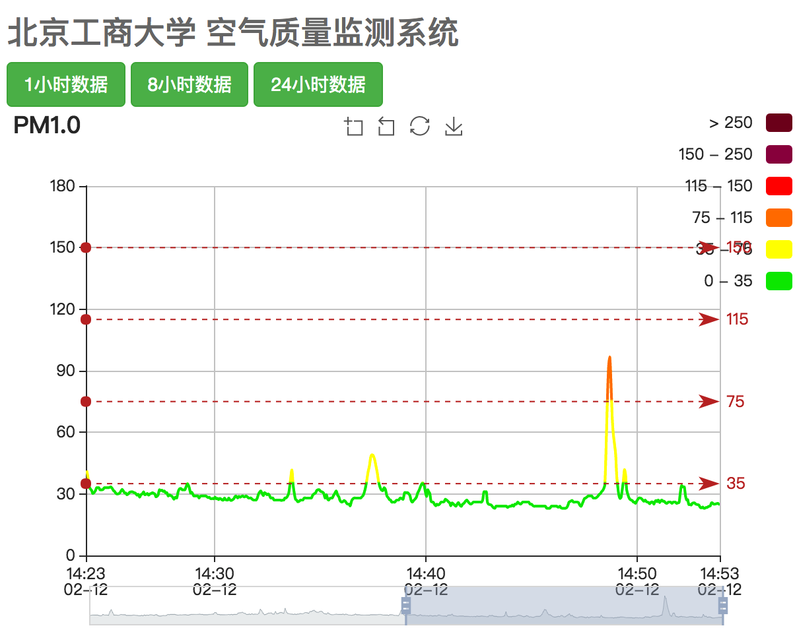


# 被忽视的问题

当我买了小米空气净化器以后，房间的 PM2.5 基本上不会过百，但是一觉醒来 CO2 会涨到 2000ppm 以上，会让人犯困，学习工作效率低。因此经常通风是非常有必要的！但是开窗又会造成 PM2.5 的飙升，所以是时候考虑一下新风系统了。

下图是中午起床以后，开门换气，PM2.5 和 CO2的曲线。


